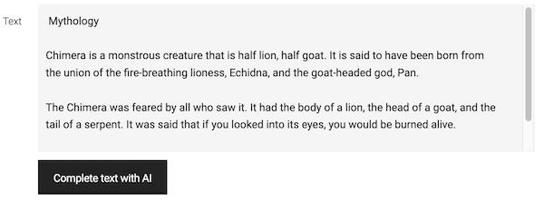
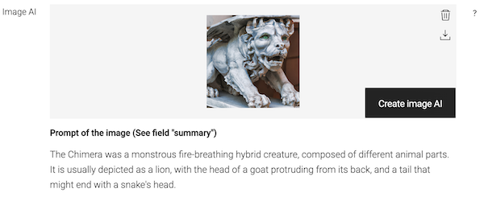

# Magnolia AI Contents


This project implements a module of [Magnolia CMS](https://www.magnolia-cms.com/) to create contents using the AI system provided by [Open AI](https://openai.com/). This module covers the creation of text and images from a given prompt or description.

## Features
- Integration with the API of [Open AI](https://openai.com/).
- UI field **textFieldAI** to create text content using [Open AI](https://openai.com/).
- UI field **imageAI** to create images from text contents stored in Magnolia.

## Modules
### ai-contents
Module of Magnolia that implements the integration with [Open AI](https://openai.com/) and the custom fields **textFieldAI** and **imageAI**
### demo-ai-contents-app
Example of content app of Magnolia. It implements a _Blog_ using the custom fields **textFieldAI** to create the text of the articles and **imageAI** for the main image.


> The _light module_ has been created as _maven module_ just to make easier the installation of the example.
### magnolia-ai-bundle-webapp
Example of a bundle of Magnolia using the module _ai-contents_

## Setup
1. Add dependency with the module _ai-contents_
```xml
<dependency>
    <groupId>org.formentor</groupId>
    <artifactId>ai-contents</artifactId>
    <version>${ai-contents.version}</version>
</dependency>
```
2. Set the environment variable _OPENAI_TOKEN_ with the _secret key_ used to authorize requests sent to the API of [Open AI](https://openai.com/)

```bash
export OPENAI_TOKEN=sk-...84jf
```

3. Specify the host of the API of [Open AI](https://openai.com/) in the property _host_ of the configuration of the module _ai-contents_


## Field _textFieldAI_


Definition of field _textFieldAI_

```yaml
textAI:
  $type: textFieldAI
  words: 180
  performance: high
```
### Field properties
#### words
Specifies the number of words of the text created using AI.
#### performance
Indicates the performance of the prediction model. Allowed values:
- **best** 
- **high**
- **medium**
- **low**
> The integration with [Open AI](https://openai.com/) maps performance with models of [Open AI](https://openai.com/), - e.g. performance **best** uses the model _"text-davinci-003"_ and **low** uses _"text-ada-001"_ -
### Example
```yaml
textAI:
  $type: textFieldAI
  rows: 12
  words: 180
  performance: high
```
## Field _imageAI_



Definition of field _imageAI_

```yaml
imageAI:
  $type: imageAI
  promptProperty: summary
```
### Field properties
#### promptProperty  
Specifies the name of the field that will be used as prompt to create the image using AI.

### Example
```yaml
subApps:
  detail:
    label: Blog
    form:
      properties:
        summary:
          $type: richTextField
          label: Summary
          height: 200
        imageAI:
          $type: compositeField
          label: Image AI
          itemProvider:
            $type: jcrChildNodeProvider
            nodeName: jcr:content
            nodeType: mgnl:resource
          properties:
            image:
              label: ""
              $type: imageAI
              promptProperty: summary # The value of property "summary" will be used to create the image
```