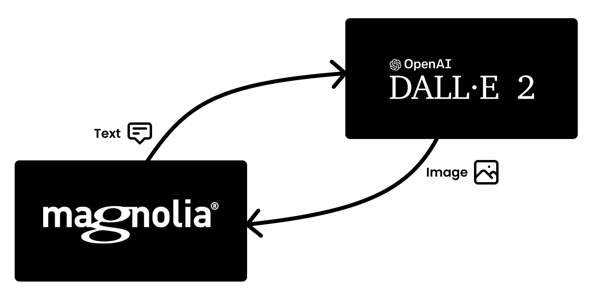

# Magnolia AI Contents

This project implements a module of [Magnolia CMS](https://www.magnolia-cms.com/) that creates contents using the AI system provided by [Open AI](https://openai.com/). The covered use case is the creation of Images from text contents stored in Magnolia.

## Features
- Integration with the API of [Open AI](https://openai.com/) to generate images from description text.
- Custom field _imageAI_ to create images in the UI of Magnolia.

## Modules
### ai-contents
Module of Magnolia that implements the client with [Open AI](https://openai.com/) and the custom field to generate images from the UI
### demo-ai-contents-app
Example of content app of Magnolia. It implements a Blog of articles that uses the custom field _imageAI_ to create the image of the Blog from the summary of the article.
> The _light module_ has been created as _maven module_ just to make easier the installation of the example.
### magnolia-ai-bundle-webapp
Example of a bundle of Magnolia using the module _ai-contents_

## Setup
1. Add dependency with the module _ai-contents_
```xml
<dependency>
    <groupId>org.formentor</groupId>
    <artifactId>ai-contents</artifactId>
    <version>${ai-contents.version}</version>
</dependency>
```
2. Set the environment variable _OPENAI_TOKEN_ with the _secret key_ used to authorize requests sent to the API of [Open AI](https://openai.com/)

```bash
export OPENAI_TOKEN=sk-...84jf
```

3. Specify the host of the API of [Open AI](https://openai.com/) in the property _host_ of the configuration of the module _ai-contents_


## Usage

Definition of field imageAI
```yaml
image:
  $type: imageAI
  promptProperty: summary
```
### Field properties
#### promptProperty  
Specifies the name of the property that will be used as image description.

### Example
```yaml
subApps:
  detail:
    label: Blog
    form:
      properties:
        summary:
          $type: richTextField
          label: Summary
          height: 200
        imageAI:
          $type: compositeField
          label: Image AI
          itemProvider:
            $type: jcrChildNodeProvider
            nodeName: jcr:content
            nodeType: mgnl:resource
          properties:
            image:
              label: ""
              $type: imageAI
              promptProperty: summary # The value of property "summary" will be used to create the image
```
> Print screen of the above form declaration


## Insights
In case of using the module *passwords* to store the secret key of [Open AI](https://openai.com/), inject the required implementation of the _OpenAITokenProvider_ 